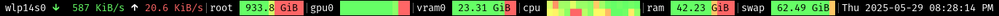

# i3 status bar generator

## Description
This is a replacement for i3status, the program that i3bar calls to generate the status line. I built this for myself, so it has no configuration. You have to edit the `main()` function at the bottom to customize it.

## Modules
- Network I/O rate: EWA smoothed rate (β = 0.9, Δt = 250ms), blinky activity icons
- Filesystem free space: Available amount, bar for proportion
- NVIDIA GPU load: Percentage, bar for proportion (or for aesthetic purposes?!)
- NVIDIA GPU VRAM: Available amount, bar for proportion
- CPU load: Stacked squares with gradient for load
- Memory and swap: Available amount, bar for proportion
- Clock: time is a flat circle

## Screenshot
It looks like this:



## Install
Clone the repo and set up the venv:
```
git clone https://github.com/slaufer/i3status.py
cd i3status.py
./setup.sh
```
In your i3 config, add:
```
bar {
  status_command /path/to/i3status.py/run.sh
}
```